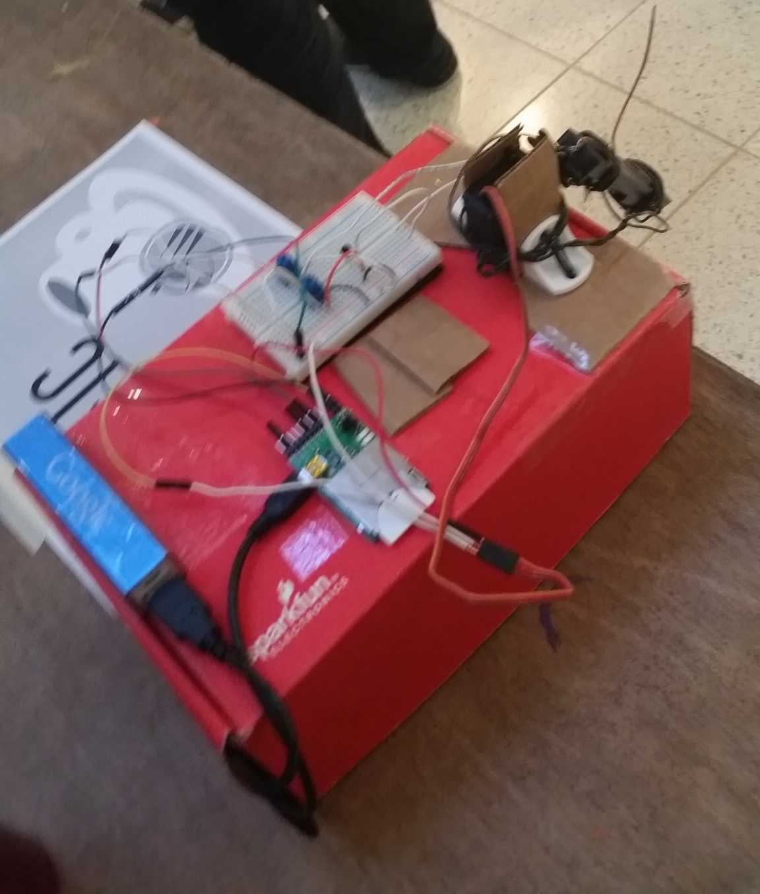

# StarCatcher

IoT device that entertains your cat (and by extension, you!). All you have to do is start it with your phone!
**[Top 16 at HackPrinceton](https://hackprinceton.com/)**

## Inspiration
My friend happened to have a laser pointer in his jacket pocket, and for some reason, I was more entertained that I should have been. And boom. StarCatcher was born! I've always wanted to do a hardware hack, yet at every hackathon I went to, somehow I ended up going with software. Well, I finally did it. Here's my first hardware hack. Enjoy!

## What it does
Have you ever wanted to make sure you could keep your cat out of trouble while you were gone? Well, now you can. StarCatcher is a little device that keeps your cat entertained and occupied when you're not home to take care of him/her. It uses hardware to move around a laser pointer, and it randomly changes direction, position, and other things to keep your cat excited! Since the device is connected to the internet, all you need to activate or deactivate it is to turn it on or off with an android app. Or just on the web. Couldn't be simpler!

## How I built it
I used Electric-Imp's interface and hardware for most of it. I also used a continuous rotation servo for moving the light source around, as well as a portable pocket laser pointer. The battery supply for the laser was replaced with a connection to a transistor testing circuit with 2 variable resistors. This connection allowed the power supply to be supplied and withheld dynamically by the state of the pin running into the transistor base junction.

## Challenges I ran into
This was the first time I've had a hardware hack at a hackathon, and I ran into a whole lot of things that I didn't expect. My main challenge was time, especially since I only started this project at around 3:30 PM or so on Saturday. I also had significant trouble with interfacing with the laser. Since the laser pointer was a full product I was just utilizing for this project, I blackboxed much of the electronics inside of it. When setting up the transistor circuit, it was really difficult to get the resistances right, so I had to use variable resistors and play around with them for a while to get everything working.

## Accomplishments that I'm proud of
Thought of an idea last minute, decided to go for it, and I stuck with it and stayed up the entire night so I could finish it, but I'm really happy I was able to get a working demo for this. I'm also really proud of how in spite of limited materials (beyond hardware, for the mechanical parts), the structure held together more or less (most  of it is wire just tied together!).

## What I learned
Hardware is hard-ware. There were so many things I didn't think would take long that actually were very difficult to get working. I also learned how important it is to read data sheets for electronic components.

## What's next for StarCatcher
1. Well, the first thing is a more sturdy frame! The current frame is just made of "hackathon materials": lots of wire wrapping instead of hot glue or solder or anything sturdy, and nothing strong to glue or solder anything to!

2. So that's the first step. Once I have that going, the next step would be to mount a camera on it so that I can make sure the light never shines on anything the cat could damage. No more scratched chairs or ripped clothing.

3. Then, I really want to implement a more sophisticated moving mechanism for the laser. That would make it more interesting both for me and I assume for the cat too. If I put wheels on it and have it be a mobile vehicle, that would be optimal.

4. Ultimately, with a pointer that a cat will follow and a mobile mechanism, the thing that springs to mind for me is Classical Conditioning. If I had some intelligent behavior in the device, the device could train the cat by creating a following pattern for the laser pointer, for instance, training a kitten to use a litter box.
